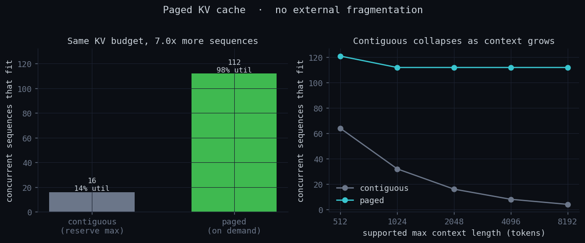
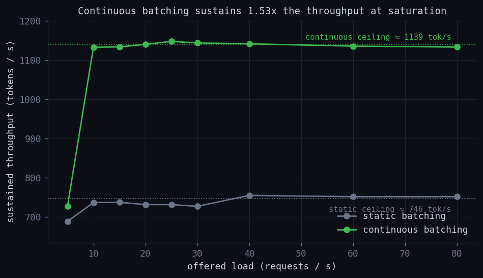
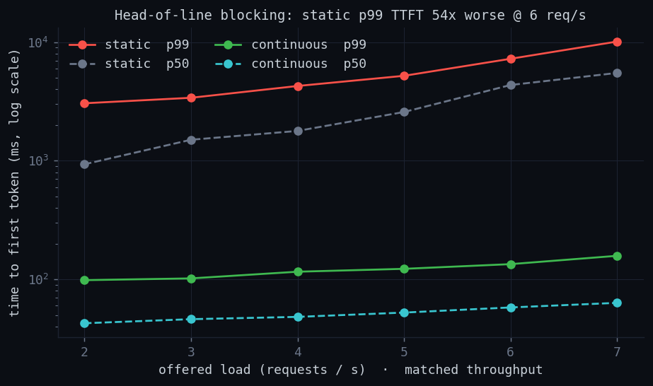
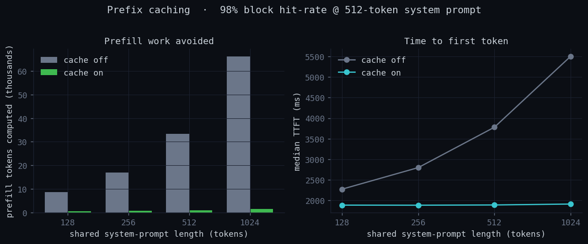

# mini-vLLM

**A from-scratch model of the *systems* core of a modern LLM serving engine —
paged KV-cache, continuous batching, preemption, and prefix caching — that runs
on a laptop with no GPU, and quantifies what each mechanism buys you with
reproducible benchmarks.**

The expensive, well-trodden part of inference is the GPU kernels. The
*interesting* part — the part that decides whether your cluster serves 1× or
several× the traffic on the same hardware — is **memory management and
scheduling**. This project implements that part for real and isolates it from
the matmuls: the compute is a deterministic latency model (so it runs anywhere
and benchmarks reproduce exactly), while the **block manager and scheduler are
real, unit-tested implementations** of the algorithms behind
[vLLM](https://github.com/vllm-project/vllm).

```
$ python -m mini_vllm.demo
mini-vLLM demo — continuous batching on a deliberately small KV pool

step   1  running= 7  prefill_tok=1024  decode= 0  KV= 38.3%  preempt=0  done=0
step   2  running=11  prefill_tok=1024  decode= 6  KV= 75.0%  preempt=0  done=0
step   3  running=13  prefill_tok= 637  decode=10  KV= 97.8%  preempt=0  done=0
step   4  running=13  prefill_tok=   0  decode=13  KV= 97.8%  preempt=0  done=0
...
final: requests=64/64  throughput=670.1 tok/s  TTFT p50/p99=4147/10047 ms  peakKV=100.0%
```

---

## Why it maps cleanly onto operating systems

PagedAttention is, explicitly, virtual memory for the KV cache. Every mechanism
here has an OS twin — which is what makes it a good way to *learn* the systems
behind inference:

| OS concept | mini-vLLM | where |
|---|---|---|
| physical frame | physical block (fixed `block_size` tokens) | `block_manager.py` |
| virtual page | logical block (index into a block table) | `request.py` |
| page table | `Sequence.block_table` (logical → physical) | `block_manager.py` |
| demand paging | blocks allocated as tokens are computed | `BlockManager.grow` |
| internal fragmentation | the partially-filled last block | `analysis.py` |
| **no** external fragmentation | any free block backs any sequence | (the point) |
| page cache / dedup | prefix caching (hashed, shared full blocks) | `BlockManager.admit_prefix` |
| copy-on-write | fork a shared partial block before a write | `BlockManager.grow` |
| swapping to disk | swap KV out to a CPU block pool | `swap_out` / `swap_in` |
| CPU scheduling (preempt) | evict the lowest-priority running sequence | `Scheduler._preempt` |
| admission control | watermark + token budget per step | `Scheduler._admit_waiting` |

---

## Architecture

```
                 ┌──────────────────────────────────────────────────┐
   add_request   │                    LLMEngine                      │
  ───────────▶   │  simulated clock · metrics · run loop             │
                 └───────┬───────────────────────────────┬──────────┘
                         │ schedule()                     │ step_latency_ms()
                         ▼                                ▼
                 ┌────────────────────┐         ┌────────────────────┐
                 │     Scheduler      │         │    ModelRunner     │
                 │  waiting/running/  │         │  simulated cost:   │
                 │  swapped queues    │         │  prefill linear,   │
                 │  continuous|static │         │  decode sublinear  │
                 │  preempt:recompute │         │  in batch size     │
                 │           or swap  │         └────────────────────┘
                 └─────────┬──────────┘
                           │ can_grow / grow / admit_prefix / swap
                           ▼
                 ┌────────────────────────────────────────────────┐
                 │                  BlockManager                   │
                 │  GPU block pool  ·  CPU swap pool               │
                 │  ref-counted blocks  ·  prefix-cache hash table │
                 │  copy-on-write  ·  per-sequence block tables    │
                 └────────────────────────────────────────────────┘
```

---

## Benchmark results

All numbers are deterministic (seeded) and reproduced by
`python benchmarks/run_all.py`. Raw values: [`docs/results.json`](docs/results.json).

### 1 · Paged vs contiguous KV — **7× more concurrent sequences**

A contiguous allocator must reserve `max_seq_len` per sequence up front; a paged
allocator reserves `ceil(len / block_size)` blocks on demand, so the only waste
is one partial block per sequence. On a 32,768-slot KV budget with realistic
(log-normal, mean ≈ 240) lengths and 2048 max context:

| | sequences that fit | KV utilization | wasted |
|---|---|---|---|
| contiguous (reserve max) | **16** | 14% | 86% |
| paged (on demand) | **112** | 98% | 2% |



The right panel is the kicker: as you support longer context, contiguous
capacity *halves with every doubling* (64 → 32 → 16 → 8 → 4) while paged stays flat.

### 2 · Continuous vs static batching — **1.5× sustained throughput**

Static batching drains a whole batch before admitting more, leaving the
accelerator idle as sequences finish at different times. Continuous batching
refills the decode batch every step. Sweeping offered load to saturation:

- static throughput ceiling: **749 tok/s**
- continuous throughput ceiling: **1139 tok/s** (1.52×)



### 3 · Time-to-first-token — **static's tail TTFT is ~77× worse**

Same Poisson sweep, restricted to the *sustainable* load range so both policies
serve the same throughput — the difference is pure latency. Static batching makes
an arriving request wait for the current batch to drain (head-of-line blocking),
so its tail explodes; continuous batching admits immediately. Across the whole
range continuous keeps **p99 TTFT under 0.7 s** while static climbs past **24 s**.
At 6 req/s: static p99 = **24,130 ms** vs continuous **314 ms** (≈77×).



### 4 · Prefix caching — **97% less prefill, 54% lower TTFT**

For a chat/RAG/agent workload where requests share an identical system prompt,
the shared blocks are hashed and computed once. With a 512-token shared prompt
across 64 requests: **98% block hit-rate**, **97% fewer prefill tokens computed**,
**54% lower median TTFT**.



---

## Quickstart

```bash
git clone https://github.com/WeishuZ/mini-vllm.git && cd mini-vllm
python -m venv .venv && source .venv/bin/activate
pip install -e ".[dev]"        # core has zero deps; [dev] adds pytest + plotting

python -m mini_vllm.demo       # watch continuous batching + preemption live
pytest -q                      # 16 tests: block manager, scheduler, engine
python benchmarks/run_all.py   # regenerate every plot + docs/results.json
```

Minimal API:

```python
from mini_vllm import LLMEngine, CacheConfig, SchedulerConfig, ModelConfig, workloads

engine = LLMEngine(
    CacheConfig(block_size=16, num_gpu_blocks=600, enable_prefix_caching=True),
    SchedulerConfig(policy="continuous", max_num_seqs=128,
                    max_num_batched_tokens=2048, preemption_mode="recompute"),
    ModelConfig(),
)
engine.add_requests(workloads.poisson(n=300, rate_rps=20, prompt_mean=256, gen_mean=128))
print(engine.run().summary())
```

---

## Design notes

- **Block manager.** Fixed-size blocks in a ref-counted pool. Sequences grow by
  demand-paging blocks as tokens are computed; the only waste is the partial
  tail block. Prefix caching publishes completed *prompt* blocks to a content-
  hash table (a block's hash includes its whole prefix, vLLM-style) so concurrent
  sequences share them; a write to a shared partial block triggers copy-on-write.
- **Scheduler.** Continuous batching advances in-flight decodes first, then
  admits new prefills with the leftover token budget — but only above a memory
  **watermark** and only when nothing was preempted this step. Those two guards
  are what keep it out of a preemption *thrashing* loop under oversubscription:
  during development, removing them turned a ~110-preemption run into a
  6,600-preemption collapse. Chunked prefill keeps long prompts from blocking
  decodes. Preemption is recompute (default) or swap-to-CPU.
- **Cost model.** Prefill is linear in tokens; decode is sub-linear *per token*
  in batch size — that sub-linearity is exactly why batching pays off and is the
  property the throughput/latency benchmarks probe.

## Honest limitations

This is a learning instrument, not a serving framework. **The compute is
simulated** — there are no real weights, kernels, or generated-text correctness;
the contribution is the memory/scheduling control plane and the measurement of
its behavior. The prefix cache shares blocks among *concurrent* sequences but
does not yet keep a freed-block evictor for cross-request reuse over time;
swap-based preemption is enabled only without prefix caching (so every block is
privately owned and swap is lossless). These are the natural next steps, and each
maps to a real vLLM subsystem.

## Repository layout

```
mini_vllm/
  block_manager.py   paged KV cache: paging, prefix cache, COW, swap
  scheduler.py       continuous + static batching, admission, preemption
  engine.py          the serving loop, clock, and metrics
  model_runner.py    simulated forward-pass cost model
  request.py         Request / Sequence token accounting
  analysis.py        contiguous-vs-paged capacity math
  workloads.py       deterministic burst / Poisson / shared-prefix workloads
benchmarks/          one script per result above + run_all.py
tests/               16 pytest unit + end-to-end tests
docs/                generated plots + results.json
```

## License

MIT © Weishu Zhang
